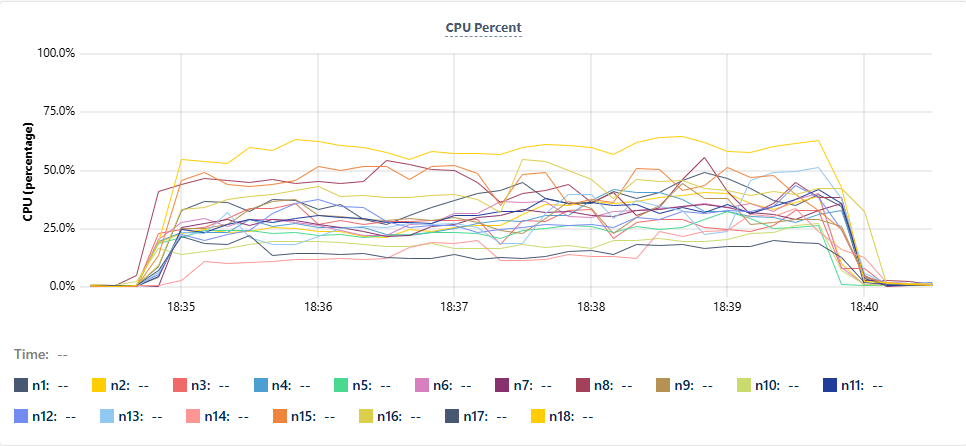

# CockroachDB Multi-Region Insert Benchmark Results

## Environment

### Advanced Cluster

**Regions**

- N. Virginia (`us-east-1`)
- Ohio (`us-east-2`)
- Oregon (`us-west-2`)

**Compute**

- `16 vCPU`
- `64 GiB RAM` per node

**Storage**

- `1200 GiB` disk per node

**Nodes**

- `18 / 18` live nodes

### App Nodes

- One app node in each region
- Instance type: `t3a.2xlarge`

## Workload Summary

Each logical unit of work inserts into 4 tables:

- `1` row into `table_a`
- `1` row into `table_b`
- `1` row into `table_c`
- `4` rows into `table_d`

That means each logical unit of work inserts:

- `7 records total`

The benchmark was run in two client modes:

- Less aggressive client:
  `--mode pipeline`
- More aggressive client:
  `--mode pipeline --pipeline-style deep --pipeline-depth 8`

The more aggressive mode queues multiple full `BEGIN ... INSERT ... COMMIT` blocks before syncing the pipeline. In this test configuration, each worker queued `8` full transaction blocks before pipeline sync, which reduced client-side waiting and increased how much work each connection could deliver to the database.

## Customer Target

- Target: `21,000 records/sec`

## Results Summary

### Final Customer-Facing Results

Using realistic row payload sizing of roughly `250-300 bytes` per inserted row:

- Less aggressive client:
  `27,409.55 records/sec`
- More aggressive client:
  `40,672.22 records/sec`

Both exceeded the target of `21,000 records/sec`.

Important note:

- These final headline results were produced using realistic inserted row payloads of roughly `250-300 bytes` per row, not the earlier smaller-row baseline.

## Detailed Results

### New Schema, Less Aggressive Client

Aggregate:

- `27,409.55 records/sec`
- `3,915.65 logical units/sec`
- `0 retries`

Per region:

| Region | Records/sec | Logical Units/sec | Avg Latency | P95 | P99 |
|---|---:|---:|---:|---:|---:|
| `aws-us-east-2` | `12,874.75` | `1,839.25` | `25.83 ms` | `35.93 ms` | `42.45 ms` |
| `aws-us-west-2` | `8,693.77` | `1,241.97` | `38.18 ms` | `71.54 ms` | `104.79 ms` |
| `aws-us-east-1` | `5,841.03` | `834.43` | `56.69 ms` | `101.72 ms` | `136.78 ms` |

### New Schema, More Aggressive Client

Aggregate:

- `40,672.22 records/sec`
- `5,810.32 logical units/sec`
- `0 retries`
- `300 second sustained run`
- `12,201,665 total inserted records`

Per region:

| Region | Records/sec | Logical Units/sec | Avg Latency | P95 | P99 |
|---|---:|---:|---:|---:|---:|
| `aws-us-east-2` | `15,399.51` | `2,199.93` | `21.62 ms` | `29.59 ms` | `34.40 ms` |
| `aws-us-west-2` | `11,622.64` | `1,660.38` | `28.44 ms` | `48.92 ms` | `65.03 ms` |
| `aws-us-east-1` | `13,650.07` | `1,950.01` | `24.17 ms` | `39.79 ms` | `51.79 ms` |

## Historical Baseline

These earlier runs were completed before the `250-300 byte` row payload sizing was added.

### Old Schema, Less Aggressive Client

- Aggregate: `31,024.58 records/sec`
- Aggregate logical units: `4,432.08/sec`

### Old Schema, More Aggressive Client

- Aggregate: `42,595.93 records/sec`
- Aggregate logical units: `6,085.13/sec`

## Readout Notes

- The test exceeded the `21,000 records/sec` target in both client modes.
- The more aggressive client mode improved throughput significantly by sending multiple full transaction blocks before pipeline sync.
- No transaction retries were observed in the final 3-region runs.
- Regional latency differences directly shaped regional throughput.
- The final headline numbers in this document are based on the realistic `250-300 byte` row-payload schema.
- The headline aggressive-client result reflects the newer `300 second` sustained run so it aligns with the attached CockroachDB UI screenshots.

## Database CPU Metrics

Suggested caption:

> CockroachDB node CPU remained well below saturation during the benchmark, indicating additional throughput headroom in the cluster.

## Suggested Additions

If we want this readout to be even stronger, I recommend adding:

- A screenshot of SQL sessions / connections during the run
- The exact benchmark commands used for:
  - less aggressive client
  - more aggressive client
- A short explanation that `1 logical unit = 7 inserted records`
- A one-line explanation of `aggressive client`:
  sending multiple full transaction blocks before pipeline sync
- A note that the final customer-facing numbers use realistic `250-300 byte` row payloads
- Optional:
  a short appendix with the old-schema baseline to show how row payload size affected throughput
